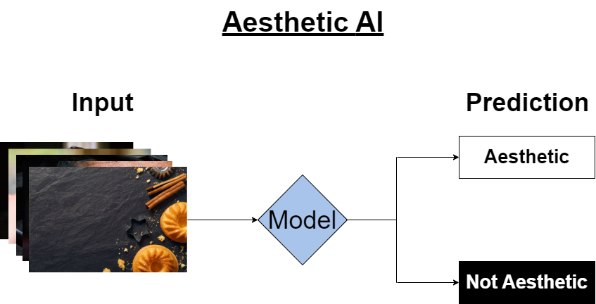

# Image Rating using CNN-Based model

  

The model takes images from the path and evaluates content and technical parameters, returning 0 or 1.  
Developing an AI that will predict if the input image is aesthetic or not.

    -->  Creating multi-model AI, in which prediction depends on quality and content of input images 
    -->  Using, developing, and optimizing feature extractor, which responsible for input images aestheticness
    -->  Trying various ML (for ex. dimensionality reduction) techniques for extracted features transformation
    -->  Creating a Fully Connected neural network for image classification (aesthetic or not)
    -->  Analyzing and cleaning training data (80k), and big test data (Big Data problems)
    -->  Using knowledge distillation for optimizing feature extractor and FC
    -->  Using Explainable AI techniques (SHAP, LIME, LRP) to get explanations of predictions
    -->  Data augmentation techniques on training dataset for making sensitive model, and on testing dataset to check sensitivity of model
    -->  Building an user friendly folder architecture and code, used OOP structure
    Qualifications:
    Neural Networks (CNN, Fully-Connected, Feature extractor), Machine Learning,
    Supervised Learning, Statistics, Knowledge distillation, Explainable AI,
    Dimensionality Reduction, Genetic Algorithm, PCA, ICA, Tensorflow, Python, OOP,  Numpy, Big Data
    Data Augmentation, Git, OpenCV, Jupyter Notebook

## Best result

<table style="width:100%">
  <tr>
    <th>Benchmark1</th>
    <th>Benchmark2</th>
    <th>Alm Benchmark</th>
    <th>Custom Benchmark</th>
    <th>Coco Benchmark</th>
  </tr>
  <tr>
    <td>94.59%</td>
    <td>95.36%</td>
    <td>95.5%</td>
    <td>94%</td>
    <td>93.4%</td>
  </tr>
</table>

## Data description
Training data contains 70075 bad images and 11024 good images

Test data:
   - Benchmark1: 111
      
         --> 47 aesthetic      
         --> 64 not aesthetic   
   - Benchmark2: 1034

         --> 534 aesthetic
         --> 500 not aesthetic   

   - Alm benchmark:        200 

         --> 100 aesthetic
         --> 100 not aesthetic

   - Custom benchmark:     200 

         --> 100 aesthetic
         --> 100 not aesthetic

   - COCO benchmark:       1000

         --> 0 aesthetic
         --> 1000 not aesthetic

## Results demonstration on benchmark data  

  

-------------------------

  

For each image numbers demonstrate model's prediction and it's confidence.

## Model

### Model architecture and hyper-parameters were chosen based on the performance on the validation set.

At first the network  resizes input image (max_resize 996x996) and gives resized image to the MultiGap network , 
in parallel of this, resizes input image with borders (resize_with _borders 600x600) and gives resized image to 
the CNN( EfficientNetB7).MultiGap returns a vector of dimension 1x16928 concats with 2560 vector from CNN, 
after features are selected using 1x5000 solution from Genetic Algorithm and gives it to the Fully Connected network,
which will return prediction.

  

### MultiGap 

MultiGap(Multi-pooled inception network)

MultiGap is a new approach to image aesthetic evaluation. 

1) a novel deep neural network architecture called MultiGAP that exploits features from multiple inception modules pooled by global average pooling (GAP), evaluated by prediction of (10-class) categorical distribution, before performing score binarization; 

2) the incorporation of textual features trained simultaneously with MultiGAP using a recurrent neural network (RNN) with gated recurrent unit (GRU) layers;

3) the ability to leverage the GAP block for visualization of activation maps based on the aesthetic category and rating.

On top of that, an extensive performance comparison between
competing methods in literature is also reported for the benefit of this growing field of research.

To learn visual features, are used GoogLeNet, a deep neural network architecture codenamed Inception proposed by Google 
as our base network. Briefly, the GoogLeNet is a network consisting of inception modules stacked upon each other, 
with occasional max-pooling layers with stride 2 added to halve the grid resolution. A single inception module consists
of a number of parallel filters to densely capture spatial correlations. Dimensionality reduction is incorporated 
through the use of 1 × 1 convolutions before the expensive 3 × 3 and 5 × 5 convolutions(see at the figure below)

  

To construct network MultiGAP, the final three inception modules are removed and a new “GAP block” is attached to each 
inception module. Each GAP block consists of an additional convolution layer followed by a global average pooling (GAP) 
layer, which reduces the feature maps to a 1-D vector of weights (see at the figure below). 

  

GAP layers are useful replacements for fully connected layers.
By adding GAP layers to the inception modules, this intuitively regularizes the ”micro network” within each module, 
reducing the proneness to overfitting at different levels of abstraction.
Then replaced the original 1000-class softmax (of ImageNet Challenge) with a 10-class softmax.

To get an IQA, the process has two steps. The first step uses multi-task learning (MTL) to predict the objective 
quality scores of multiple FR-IQA metrics simultaneously. Introduced histogram equalization used to improve learning. 
The MTL framework allows you to train a deep model on a large-scale unrated image set, such as KADIS-700k. 
In the second step, Multi-Level Spatially Pooled (MLSP) includes the extracted from the finely tuned CNN model 
from the first step to represent the given image. For IQA database data, e.g. KADID-10k, a new regression network is trained
non-linearly map MLSP features to their respective subjective indicators of quality.

Because the objective quality measures of FR-IQA(Full-Reference Image Quality Assessmen) methods are highly correlated 
with subjective quality measures, the learned function is also expected to be highly correlated with subjective 
quality measures. To this end, multitasking training with deep CNNs is performed to model the described function.

The architecture deep CNN model for MTL(Multi-Task Learning) is illustrated in below figure. We feed an image into the CNN
base of InceptionResNetV2 and use Global Average Pooling (GAP) for each feature map. The resulting feature vector passes
through K separate task modules, predicting the K FR-IQA scores.
Each task module consists of five layers. These are fully-connected (FC) with  512 units, dropout with rate 0.25,
FC with 256 units, dropout with rate 0.5, and output with one neuron. The deep CNN model aims to predict the objective 
scores from K = 11 available FR-IQA methods. These methods are SSIM, MS-SSIM, IW-SSIM, MDSI, VSI, FSIMc, GMSD, SFF, 
SCQI, ADD-GSIM and SR-SIM. The MTL framework has the following merits. Firstly, it is very convenient to generate 
distorted images given large-scale pristine reference images and to estimate their objective quality scores
via FR-IQA methods. Therefore, training a deep CNN on large-scale images to address over-fitting becomes feasible.
Secondly, although several FR-IQA methods have been proposed in the last decade, there is no single FR-IQA method 
that significantly outperforms the rest. One method may be superior for some distortion types, but inferior for 
others as different methods extract different features and use different pooling strategies. Therefore, learning to 
predict objective quality scores from multiple FR-IQA methods rather than from a single FR-IQA method by using a shared 
CNN body reduces the risk of over-fitting.

  

To make a fair and comprehensive comparison, were conducted as follows: In the MTL stage, KADIS700k was divided 
into a training set of 600,000 images and a validation set of 100,000 images. There was no test set as it was 
unnecessary to evaluate the model at this stage. In the visual quality prediction stage, all databases were randomly 
split into a training set (60%), a validation set (20%), and a test set (20%). All the divisions are on the basis of 
the content of reference images so there is no content overlapping between the three subsets.
All the models and loss functions in experiments were implemented using the Python Keras library with Tensorflow as a
backend  and ran on two NVIDIA Titan Xp GPUs with a batch size of 64. The InceptionResNetV2 CNN body was initialized 
with pre-trained weights from ImageNet. The weights of FC layers were initialized with the method of He et al. 
The ADAM optimizer was used for optimization, with a custom learning rate α and default parameters β1 = 0.9, β2 = 0.999. 
In the MTL stage, fixed α at 10^(−4) . In the visual quality prediction stage, use α = 10^(−1) , 10^(−2) , . . . , 10^(−5) and 
chose the value that gave the best validation result. Considering the large size of KADIS-700k, 
only trained for 10 epochs in the MTL stage. Trained for 30 epochs in the visual quality prediction stage.

### CNN
In project has been used EfficientNetB7 as CNN.

EfficientNet is a convolutional neural network architecture and scaling method that uniformly scales all dimensions of 
depth/width/resolution using a compound coefficient. Unlike conventional practice that arbitrary scales these factors, 
the EfficientNet scaling method uniformly scales network width, depth, and resolution with a set of fixed scaling coefficients.

-----------------

EfficientNet-B7 architecture  

  

EfficientNet-B7 network has a 64.097.680 parameters.  
The model accepts inputs of any size.

MBconv1 and MBconv6 architecture

  

EfficientNet-B7 achieves state-of-the-art 84.3% top-1 accuracy on ImageNet,  while being 8.4x smaller and 6.1x faster
on inference than  the best existing ConvNet. EfficientNets also transfer well and achieve state-of-the-art accuracy 
on CIFAR-100 (91.7%), Flowers (98.8%), and 3 other transfer learning datasets, with an order of magnitude fewer parameters. 

### FC 

The Fully Connected network consists of 3 dense layers, with batch norm and dropout layers in between. It takes 
a concatenated feature vector as an input, and outputs a probability score for each of the 2 labels. 

  

## Training

Model training:

    --> Extracting train image multigap features and saving with .json

    --> Extracting train image cnn features and saving.

    --> Loading cnn and multigap features, concatenating and selecting 5000 features with Genetic Algorithm and train FC.

### Genetic Algorithm
Genetic algorithms are a particular class of evolutionary algorithms (also known as evolutionary computation) 
that use techniques inspired by evolutionary biology such as inheritance, mutation, selection, and crossover 
(also called recombination). It is based on Charles Darwin's theory of natural evolution and uses the principles
of selection and evolution to produce several solutions to a given problem.

  

Genetic algorithms terminology:

    Individual - Any possible solution
    Population - Group of individuals
    Search Space - All possible solutions
    Chromosome - Blueprint for an individual
    Trait - Possible aspect of an individual
    Allele - Possible settings for a trait
    Locus - The position of a gene on the chromosome
    Genome - Collection of all chromosomes for an individual

#### Input

The input to the GA is a set of potential solutions to that problem, encoded in some fashion. These candidates may be 
solutions already known to work, with the aim of the GA being to improve them, but more often they are generated at random.

#### Fitness function

A metric that allows each candidate to be quantitatively evaluated.

#### Summary

The GA evaluates each candidate according to the fitness function activity.
Individuals with high fitness can be termed as promising candidates. These
promising candidates are kept and allowed to reproduce. From them multiple
copies are made, but the copies are not perfect; random changes are introduced
during the copying process. These digital offspring then go on to the next
generation, forming a new pool of candidate solutions, and are subjected to a
second round of fitness evaluation. Those candidate solutions which were
worsened, or made no better, by the changes to their code are again deleted. The
expectation is that the average fitness of the population will increase each round.

  

--------------

### Population/Initialization/Generation

100 vectors with shape (5000) that contain the indices of features to be selected are initialized and form the 
first population. During a generation, the algorithm iterates over all 100 vectors and trains FC using 
the selected features. A fitness score is assigned to each vector (fit score is the accuracy on test data).

-----------

### Selection

  

After the generation ends, the algorithm enters the phase of selection. During selection, the vectors in population are
sorted based on their fit scores. The 2 best vectors will be kept for the next generation. The top 50 vectors based on 
their fit scores, including the 2 to be kept in the next gen, are selected for crossover. After crossover, the 48 parents
(not the 2 best that will be kept) are selected for mutation.

------------------

### Crossover

The crossover operator is analogous to reproduction and biological crossover. In this more than one parent is selected
and one or more off-springs are produced using the genetic material of the parents. Crossover is usually applied in a
GA with a high probability.

  

The parents that are selected during the selection step enter the crossover function. We select n parents from all the 50
 parents to produce 1 child.  For example, (0, 1, ... n) parents will produce the first child, (1, 2, ... n+1) parents will 
 produce the second child, etc. Thus we will have 50 children in the end. The indices that repeat more in the n parents will
be prioritized to be included in the child solution.
After the crossover, the population of 50 children will replace the 50 worst solutions in the population

-------------------

### Mutation

Mutation may be defined as a small random tweak in the chromosome, to get a new solution.
It is used to maintain and introduce diversity in the genetic population.

The mutation function takes the solutions selected during the selection step. It keeps a given % of genes in each solution, and mutates the other genes. The mutation randomly takes a number from range(19488) (all the available indices to be included in the solution), and places it in place of the gene to be mutated. The mutation is done so that all indices in a vector remain unique.
After mutation, the whole mutated population is placed in the same place from where it was selected during selection ([2, 50] lines in our population matrix)

### XAI

Explainable artificial intelligence (XAI) is a set of processes and methods that allows human
users to comprehend and trust the results and output created by machine learning algorithms.
Explainable AI is used to describe an AI model, its expected impact and potential biases.
It helps characterize model accuracy, fairness, transparency and outcomes in AI-powered decision making.
Explainable AI is crucial for an organization in building trust and confidence when putting 
AI models into production. AI explainability also helps an organization adopt a responsible approach to AI development.

  

The Explainable AI (XAI) program aims to create a suite of machine learning techniques that:

    1.Produce more explainable models, while maintaining a high level of learning performance (prediction accuracy)
    2.Enable human users to understand, appropriately trust, and effectively manage the emerging generation of artificially
    intelligent partners.
----

#### Shap

SHAP (Shapley Additive Explanations) by Lundberg and Lee (2016) is a method to explain individual
predictions, based on the game theoretically optimal Shapley values. 
The goal of SHAP is to explain the prediction of an instance x by computing the contribution of each feature 
to the prediction. The SHAP explanation method computes Shapley values from coalitional game theory. 
The feature values of a data instance act as players in a coalition. Shapley values tell us how to fairly 
distribute the “payout” (= the prediction) among the features. A player can be an individual feature value, 
e.g. for tabular data. A player can also be a group of feature values. For example to explain an image, pixels
can be grouped to superpixels and the prediction distributed among them. One innovation that SHAP brings to the 
table is that the Shapley value explanation is represented as an additive feature attribution method, a linear model.
That view connects LIME and Shapley values. SHAP specifies the explanation as

 

where g is the explanation model, 

is the coalition vector, M is the maximum coalition size and  

is the feature attribution for a feature j, the Shapley values.

  

In this project, Shap explains why the model made such a prediction (aesthetic or not aesthetic).
The top figure shows the result of Shap. The red ones are the segments that contributed to the prediction,
and the blue ones counteracted to the prediction.

#### Lime

The beauty of LIME(Local Interpretable Model-agnostic Explanations) its accessibility and simplicity. 
The core idea behind LIME though exhaustive is really intuitive and simple.

    1.Model agnosticism refers to the property of LIME using which it can give explanations for any 
      given supervised learning model by treating as a ‘black-box’ separately. This means that LIME can 
      handle almost any model that exists out there in the wild!
    2.Local explanations mean that LIME gives explanations that are locally faithful within the 
      surroundings or vicinity of the observation/sample being explained.

When given a prediction model and a test sample, LIME does the following steps:

    1.Sampling and obtaining a surrogate dataset: LIME provides locally faithful explanations around
      the vicinity of the instance being explained. By default, it produces 5000 samples(in this project num_samples=1000)
      of the feature vector following the normal distribution. Then it obtains the target variable for these 
      5000 samples using the prediction model, whose decisions it’s trying to explain.
    2.Feature Selection from the surrogate dataset: After obtaining the surrogate dataset, it weighs
      each segment according to how close they are from the original sample/observation. Then it uses a feature
      selection technique like Lasso to obtain the top important features.

  

In the top figure the green ones are the segments that contributed to the prediction,
and the red ones counteracted to the prediction.

### Principal Component Analysis (PCA)
The goal of principal component analysis is to compute the most meaningful
basis to re-express a data set. X is the original data set, where each column is
a single sample of our data set. In the case here X is an m x n matrix where m
is the number of features and n is the number of data points. Let Y be another
m x n matrix composed by applying a linear transformation P on our X. X is
the original recorded data set and Y is a re-representation of that data set

  
  

  
  The rows of P are a new set of basis vectors for representing columns of X.
The row vectors {
    
} in the transformation P will become the principal
components of X.
  Another thing to know is covariance.
Covariance measures the degree of
the linear relationship between two variables. We define the covariance matrix
C. which is a symmetric m x m matrix, representing the covariance between
features. The diagonal terms of C are the variance of particular features on the
span of our data.
The off - diagonal terms of C are the covariances between
features. Thus, we want our C to be diagonal, because we want the covariance
between features to be 0.
We also want the variances on the diagonal to be
maximized.

We define a new matrix

(the covariance matrix for our X data) where A is symmetric.

  

  A symmetric matrix (A) is diagonalized by an orthogonal matrix of its eigenvectors. 
The matrix P is selected to be a matrix where each row 
  
 is an eigenvector of 
 
. So 

 

Where D is the Diagonal matrix (which will be the covariance matrix of the output Y).
 Thus, we redefine 
  
to
  

  

So the diagonal matrix D is computed, which represents the covariance of our Y output. 
That means that Y has 0 covariance between features and maximized variance for each feature. 
For dimensionality reduction the selected P transform matrix contains only a desired number of 
components (eigenvectors with larger (sorted) eigenvalues). After that the XP dot product 
is computed and results in Y output..  	
In our case 8464 was selected to be the number of components to reduce MultiGap features,
 and 1280 to reduce CNN features. Each of the 2 PCA models was separetly fitted on ~80000 
training data points (16928x80000 matrix extracted from MultiGap and 2560x80000 matrix 
extracted from CNN). After the fitting process the models were saved. Now, during each 
prediction the feature vector is reduced by passing through the corresponding model 
(pca_cnn or pca_mg), and only after that enters the fully connected part (which was trained 
on pca-reduced feature vectors for the 80000 data points (16928 -->8464 for MG and 2560 -->1280 for CNN).

